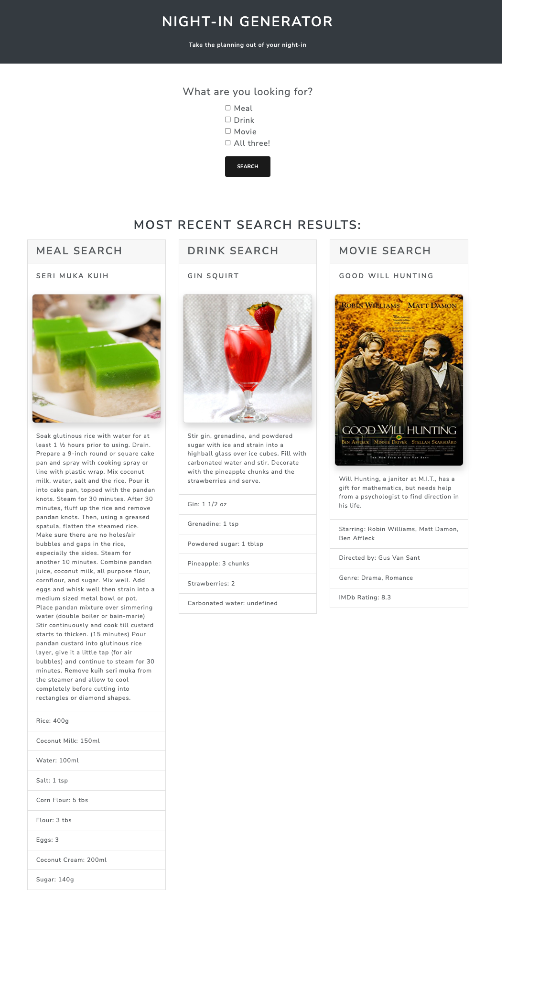

# night-in-generator
## Description
This application allows users to generate the perfect plans for a night at home. By using HTML, Javascript, Bootstrap, Local Storage, and APIs, this application meets the following criteria: 

- utilize user input to search for desired results (meal, drink, movie, or all three)
- display most recent search results upon loading screen
- utilize modals to instruct user on invalid input
- concat data using server side APIs
## Deployed Application

### URL
[Night-In Generator](https://cdgonzo23.github.io/night-in-generator/)
### Screenshot

## Usage
- Click the checkboxes to choose which items you would like to search for.
- Click the "All Three" checkbox to search for a meal, a drink, and a movie!
## Collaborators
[Christian Gonzales](https://github.com/cdgonzo23)

[Chesney Julian](https://github.com/ChesneyJulian)
## Resources
[Meal API](https://www.themealdb.com/api.php)

[Drink API](https://www.thecocktaildb.com/api.php)

[Movie API](https://www.omdbapi.com/)